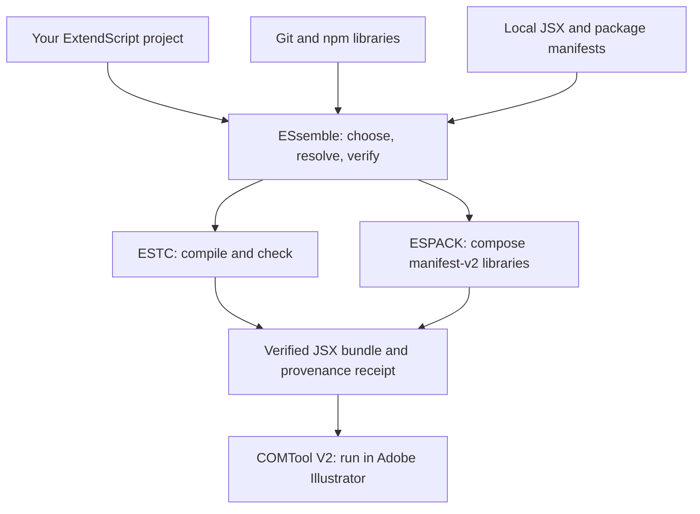

<div align="center">

# ESsemble: modular framework and composition layer for Adobe ExtendScript (ES3)

### An extensible ExtendScript development framework. Bring any script or library; use only the tools you need.

[](https://github.com/thelabcorner/essemble/actions/workflows/ci.yml)
[](https://nodejs.org/)
[](https://extendscript.docsforadobe.dev/)
[](#status)

</div>

---

ESsemble is an open, extensible development environment for Adobe ExtendScript. **It is not a runtime, compiler, or linker.** It gives consumers coordinated access to the actual ExtendScript runtime through COMTool, to compatibility checks through ESTC, to artifact linking through ESPACK, and to independently developed libraries. Your own JSX scripts and third-party Git libraries are first-class build inputs, not second-class exceptions to the ES* catalog.

ESsemble sits above the independent ESON, ESB64, ESARR, ESSTR, ESCHARS, ESHTTP, ESTIMER, ESRAND, ESUUID, ESPACK, ESMIN, ESABI, VectorIPC, ESTC, ESDB, COMTool, and ESOBF projects.

It does **not** merge those repositories into one codebase. Each component remains independently versioned and usable. ESsemble owns selection, dependency closure, provenance, composition policy, and the developer-facing framework UX.

## How ESsemble fits together



ESsemble coordinates these tools. It does not replace their compilers, linkers, or runtime contracts. A plain JSX-only project does not acquire the ESPACK runtime loader.

## Install independently of the ES* source checkouts

ESsemble's npm package contains its **own** framework code, CLI, registry, schemas, profiles and default release lock. It does **not** vendor ESTC, ESPACK, COMTool or any ES* library into the package. In this unreleased checkout, create and inspect a local package archive with:

```bash
npm pack --ignore-scripts
# Install the resulting essemble-0.2.0.tgz in a separate developer project:
npm install --ignore-scripts ./essemble-0.2.0.tgz
```

The installed package does not automatically install the independent toolchain executables. You can use the CLI to initialize a project or manage source selections before connecting any tools. For linking and compatibility checking, point ESsemble at independently installed tool roots (the paths below are illustrative):

```bash
# Use platform-appropriate environment configuration for these variables.
export ESPACK_ROOT=/opt/tools/espack
export ESTC_ROOT=/opt/tools/extendscript-toolchain
export COMTOOL_ROOT=/opt/tools/comtool-v2

./node_modules/.bin/essemble tools --json
./node_modules/.bin/essemble build
```

On Windows, set the same variables with PowerShell's `$env:ESPACK_ROOT`, `$env:ESTC_ROOT`, and `$env:COMTOOL_ROOT` syntax, or use an explicit `COMTOOL_NODE_SDK_PATH` to a COMTool SDK `index.mjs` file. ESsemble also recognizes compatible sibling checkouts and separately installed npm tool packages. **A broken explicitly configured tool root fails closed** instead of silently running a different version. ESTC compilation additionally requires its independent dependencies to be installed.

When selecting released ES* components, downloaded immutable manifests are kept in the **consumer project's** `.artifacts/sha256` directory rather than in ESsemble's installation. Reproducible receipts record the ESPACK provider and the hashes of its three core composition modules. An external non-Git ESPACK installation is not falsely labeled with ESsemble's original checkout revision. The underlying tool installations must still be available when rebuilding.

The package archive is smoke-tested by unpacking it into an independent directory, invoking its CLI from an unrelated consumer project, building raw JSX with separately installed tools, and checking receipt rebuild fidelity. This is not a claim that ESsemble has been published to the public npm registry.

## Build your own ExtendScript project

Run the installed ESsemble binary (or `node <path-to-essemble>/bin/essemble.mjs`) from **your own project directory**, not the ESsemble installation directory:

```bash
essemble init
essemble add ./src/colors.jsx ./src/renderer.jsx
essemble add ./vendor/geometry/
essemble add github:another-author/illustrator-geometry#dist/geometry.jsx
essemble add npm:vector-geometry
essemble add npm:@vendor/geometry#dist/extendscript.jsx
essemble resolve --entry runtime
essemble build
essemble check
essemble verify dist/runtime.receipt.json --rebuild
essemble tools

# Run an already-built artifact inside a running Illustrator host using COMTool V2.
essemble run --entry runtime --timeout-ms 90000

# Verify a build's ES* composition inside Illustrator through COMTool V2.
essemble live dist/runtime.receipt.json
```

### TypeScript development through ESTC

ESsemble does not implement its own TypeScript compiler or dialect transforms. `essemble compile` invokes the independently maintained **ESTC** build pipeline in a child Node process, stages its output, and publishes the compiled JSX only if ESTC reports success:

```bash
# Requires a runnable ESTC checkout with its npm dependencies installed.
essemble compile --config extendscript.config.mjs --out dist/typed.jsx

# To additionally combine the compiled JSX with third-party or ES* libraries:
essemble add ./dist/typed.jsx
essemble build
```

For a single project-entry command, declare an optional compiler in `essemble.json`:

```json
{
  "schemaVersion": 1,
  "entries": {
    "runtime": {
      "use": ["./vendor/helpers.jsx", "eson"],
      "compiler": { "config": "extendscript.config.mjs", "out": "dist/typed.jsx" },
      "out": "dist/runtime.jsx"
    }
  }
}
```

Run `essemble build --allow-plugins` to explicitly trust the executable `extendscript.config.mjs` for an automatic compiled entry. The compiler output cannot collide with the distribution output, manifest, or receipt. A compilation failure leaves the previous compiled output intact; linked distribution files are published only after the final compatibility gate succeeds. The build receipt records the compiler provider, configuration SHA-256, reported TypeScript input hashes and the compiled JSX hash. Verification checks those inputs and rebuilds the **distribution from compiled JSX**; it does not claim to independently reproduce the TypeScript compilation or hash every transitive TypeScript configuration dependency.

The `ESTC_ROOT` environment variable can select a separately installed ESTC checkout, retaining its own npm dependencies. `essemble tools --json` reports compile dependency readiness separately from ESTC's lightweight JSX checker availability. The framework does not implicitly install missing compiler packages or execute npm lifecycle scripts from consumer libraries.

The CLI also accepts `--project-dir PATH` without changing the shell's working directory. `essemble.json`, outputs and receipts belong to the consumer project. The built-in ES* registry and tool executables belong to the framework installation. Release locks are read from the consumer's `essemble.lock.json` when present, otherwise from the framework's defaults; running `essemble lock` from a consumer project writes a **consumer-local** lock rather than editing the framework installation.

Supported sources:

- Raw local `.jsx`, `.jsxinc`, and `.js` files, with no special manifest, global-variable contract, or installation step.
- Local directories with `package.json` `essemble.entry` or `main` pointing to a compatible script (otherwise `index.jsx`). Optional `essemble.dependencies` declare transitive library requirements. Installation scripts are never run.
- Local ESPACK `.manifest.json` files, retaining their ESPACK dependency and native-artifact semantics.
- Git repositories using `github:owner/repo#src/index.jsx` or `git+https://host/repo.git#index.jsx`. On `essemble add`, HEAD is resolved **once** and an immutable 40-character commit is persisted in `essemble.json`; explicit `@<40-character-commit>` pins are also accepted. Builds never silently follow newer commits.
- Already installed npm packages using `npm:package` or `npm:@scope/package#path/to/entry.jsx`. The add command reads the installed `package.json` and stores an exact version pin; future builds refuse package version drift. Both ordinary JSX files and ESPACK `.manifest.json` entrypoints are supported.
- Independently published ES* components selected by ID and optional exact version.
- Additional source schemes contributed by explicitly trusted project plugins.

Literal relative `#include` directives are recursively expanded with cycle/size checks; included files are independently checksummed in the receipt. The directive scanner distinguishes actual preprocessor statements from examples inside comments and quoted strings. Repeated includes retain their repeated evaluation semantics, while input snapshots and parsed directive lists are cached within one expansion to avoid redundant reads. Includes from consumer-owned sources cannot escape the project through relative traversal or symlinks. `#target` and `#targetengine` declarations are hoisted ahead of generated content and conflicting declarations cause an error. Raw scripts run in declared source order **after** linked ESPACK libraries. Existing ES* dependency closures remain typed, and the ESB64/ESPACK cycle remains explicit.

### Optional local library metadata

Third-party libraries work without adopting ESsemble. Authors who want automatic dependencies can use their existing `package.json`:

```json
{
  "name": "illustrator-geometry",
  "main": "src/index.jsx",
  "essemble": {
    "entry": "src/index.jsx",
    "dependencies": [
      "./src/polyfills.jsx",
      "../shared/",
      "esuuid"
    ]
  }
}
```

`essemble add ./vendor/illustrator-geometry` imports its entrypoint **and its declared requirements**. Local dependencies resolve relative to the declaring package directory, are ordered before the consuming entrypoint, and are deduplicated. ES* IDs remain ordinary component requirements. Circular declarations and implicit paths escaping the consumer project are rejected; package metadata is checksummed in receipts, so dependency changes invalidate verification. These are ESsemble-specific dependency declarations, not a replacement for npm dependencies, whose Node package execution semantics may be incompatible with ES3.

### Libraries from installed npm packages

Use your existing npm workflow to install packages into your consumer project's `node_modules`, then select their ExtendScript-compatible entrypoints:

```bash
# Package installation is intentionally an independent, explicit user action.
npm install --ignore-scripts your-extendscript-library@1.2.3
essemble add npm:your-extendscript-library
# ESsemble pins npm:your-extendscript-library@1.2.3 in essemble.json.
essemble build
```

An npm library can expose a `package.json` `essemble.entry` property, a conventional `main`, or an explicitly selected `#entry.jsx`. Optional `essemble.dependencies` are resolved before its entrypoint. Dependencies can themselves be npm sources, local libraries, or ES* components; npm package dependencies should themselves use exact `npm:name@version` pins. The `essemble resolve --entry runtime` command includes transitive ES* component requirements in its typed dependency plan, and `essemble lock` includes them in its requested release set. A package must already be installed, its metadata `name` and `version` must match the selector, and its real path must stay within the consumer project. npm symlinks escaping the project are rejected in favor of an explicit local source path. ESsemble **does not automatically install packages or run lifecycle scripts**, nor does it assume that arbitrary npm JavaScript is compatible with Adobe's ES3 dialect; ESTC remains the compatibility gate. Sources and package metadata are separately recorded in receipts.

Pinned Git scripts are similarly integrity-checked against Git's own blob identities. Their project-local cache reuses unchanged blobs, repairs corrupt cached blobs from the pinned Git object, rejects symlink/junction redirection, and uses staged clone and source publication to support concurrent builds. A Git URL and commit identify the source; neither mutable branches nor a package's `postinstall` hook participate in builds.

**Zero-runtime-overhead mode:** when the selection consists solely of ordinary JSX/JS files, ESsemble emits only the selected source code and provenance comments. ESPACK still produces the receipt-compatible manifest, but its runtime composition control plane is not injected. Mixing even one ESPACK distribution retains normal ESPACK linking and runtime semantics.

### Extensible source providers and tool adapters

Plugins are ordinary `.mjs` modules exporting a default object with optional `sourceProviders` and `tools` arrays. A source provider defines `id`, `match(spec)` and `resolve(projectRoot, spec)`; it must return a concrete `script` or `manifest` source with `file`, `path`, `bytes`, and `sha256`, and `text` for scripts. ESsemble verifies the declared SHA against the materialized file, checks that emitted script text matches the include-expanded source, and derives its provenance paths rather than trusting arbitrary provider metadata. A tool adapter defines `id`, `capabilities`, and corresponding named async methods. Built-in tool adapters expose `check` (ESTC), `compose` (ESPACK), `live` and `run` (COMTool). ESsemble does not reimplement them.

```json
{
  "schemaVersion": 1,
  "plugins": ["./plugins/custom.mjs"],
  "entries": {
    "runtime": {
      "use": ["eson", "./src/main.jsx", "my-source:example"],
      "out": "dist/runtime.jsx"
    }
  }
}
```

Run `essemble build --allow-plugins` to approve loading the listed plugin modules. **Plugins execute arbitrary Node.js code in the developer environment.** They are never executed merely because an untrusted project directory was opened. External source files themselves do not execute as build-time JavaScript; only explicit tool/plugin adapters do. Unknown source schemes fail closed instead of silently being interpreted as ES* catalog IDs.

When two tools offer the same capability (such as two `check` providers), ESsemble refuses ambiguous selection. Choose explicitly:

```json
{
  "plugins": ["./plugins/custom-checker.mjs"],
  "toolProviders": { "check": "custom-checker", "compose": "espack" }
}
```

The build and reproducible rebuild **actually invoke** the selected `check` and `compose` adapters. Selected provider IDs and project plugin entrypoint file hashes are recorded in the receipt; rebuilding with a different provider fails before execution, and modifying a plugin after building invalidates the receipt. Plain receipt hash verification is read-only and does not activate executable plugins. Imported helper modules used by plugins are not yet independently enumerated in the receipt; portable hermetic builds are future work.

Build receipts retain checksums for all raw inputs, transitive includes, pinned Git origin metadata and bundled ESPACK manifests. `essemble verify --rebuild` additionally regenerates outputs from these checked inputs. The working files must remain available; receipts are currently reproducible from the same project tree and tool checkout, not fully hermetic or portable archives.

Output, manifest, and receipt destinations must remain inside the consumer project, including through existing symlinks or junctions. The three artifacts are prepared before publication; the receipt is published last as a completion marker, and the publication routine rolls back already-updated files if a subsequent rename fails. This is **single-writer failure recovery**, not a cross-file atomic filesystem transaction or protection from two independent builders racing to write identical paths. Absolute sources outside the project require `--allow-external-sources` during receipt verification; prefer vendoring sources into the project for portable receipts.

Git source resolution extracts only tracked script files reachable from the entrypoint's literal relative `#include` graph at the pinned revision (not the entire repository). It rejects symlinks/submodules, root traversal, unsupported file types and excessive include depth/size. No Git checkout hooks, npm lifecycle scripts, or third-party JSX files run in Node during composition.

### Real runtime access belongs to COMTool

`essemble run` delegates `ComToolRunner.runFile` to the installed COMTool V2 Node SDK; no JSX interpreter exists inside ESsemble. It forwards the target ID, Adobe host, watchdog and side-effect classification; it preserves the SDK's ambiguous-execution classification and **never automatically retries a submitted script**. Run an `essemble build` first if you want ESsemble's fully combined artifact. COMTool requires its own compatible CLI and live host; `essemble tools` reports adapter installation, not a guaranteed live connection.

`essemble live` verifies the composition receipt before issuing a runtime probe through the modern `ComToolRunner.testFile` API. Existing ESTC-based `--launch` compatibility remains available where the legacy ESTC CLI supports it. ESTC's syntax/compatibility check is separate from both runtime commands; it is never substituted for actual host execution. CLI `--target` is a COMTool target identifier for runtime calls, not a request to change the compiled source's target.

## Architecture invariants

The initial scaffold establishes four invariants:

1. **Independent repositories stay independent.** Git-backed components live under `components/` as nested repositories / submodule candidates.
2. **Selection is separate from installation.** A complete ESsemble checkout may contain every component while a resolved runtime can contain only ESON + ESUUID, or any other requested subset.
3. **Dependency relationships are typed.** Runtime, build, composition, native ABI, validation, benchmark, prototype, and integration relationships are not interchangeable.
4. **The rollout graph is not the consumer graph.** ESsemble imports its evidence, but only closes over dependency lanes explicitly requested by a profile or command.

## Quick start

```bash
node bin/essemble.mjs list
node bin/essemble.mjs profiles

# Smallest runtime selection: no build/native/composer fanout.
node bin/essemble.mjs resolve --use eson,esuuid

# Ask for the production construction closure as well.
node bin/essemble.mjs resolve \
  --use eshttp \
  --scopes runtime,build,compose,native

# Resolve a named framework profile.
node bin/essemble.mjs resolve --profile runtime
node bin/essemble.mjs resolve --profile full

# Materialize clean, locked component checkouts without touching sibling /scripts repos.
npm run components:materialize

# Reconcile only a release wave; unrelated dirty components are not inspected.
npm run components:materialize -- --only esb64,espack,eson,esarr

npm run verify
```

Use `--json` on `list`, `profiles`, `tools`, `check`, `resolve`, `build`, `verify`, `live`, or `doctor` for machine-readable output.

## Profiles

| Profile | Selection | Closure |
|---|---|---|
| `minimal` | Nothing implicit; combine with `--use` | `runtime` only |
| `runtime` | All currently cataloged runtime primitives | `runtime` only |
| `full` | Every currently distributable ESsemble component | Runtime + build + compose + native + optional runtime + integration |

ESOBF is cataloged as `preview` and workspace-local for now, so `full` deliberately does not depend on an unpublished source.

## Why typed dependency lanes matter

The existing ES ecosystem rollout model contains relationships such as:

```text
ESTC -> ESON              build-toolchain
ESABI -> ESON             native-ABI
ESB64 + ESPACK -> ESON    composed-bundle
ESRAND -> ESUUID          optional-runtime
```

Those relationships answer different questions.

A script that only wants ESON's portable runtime should not automatically receive ESTC, ESABI, ESB64, and ESPACK. A framework build producing ESON's accelerated artifact may need those construction dependencies. ESsemble therefore resolves them only when the relevant lanes are requested.

The ESB64/ESPACK artifact cycle is modeled explicitly and returned as one resolution group rather than being hidden behind an arbitrary ordering rule.

## Repository layout

```text
essemble/
├── bin/                    CLI entry point
├── components/             independent nested component repositories
├── profiles/               named selection + dependency-lane policies
├── registry/               transitional umbrella component catalog
├── schemas/                machine-readable catalog/profile/lock contracts
├── scripts/                validation and component materialization
├── src/                    resolver, catalog loader, doctor, CLI
├── tests/                  deterministic resolver tests
├── .gitmodules             Git-backed component map
└── essemble.lock.json      exact source revisions
```

## Component model

The initial catalog is transitional. It centralizes metadata so the resolver can be validated before modifying every independent project.

The intended end state is:

```text
component-owned manifests
        +
ESsemble policy
        ↓
generated umbrella catalog
        ↓
resolver / composer / CI / rollout tooling
```

That keeps one component definition close to the component itself while allowing ESsemble to expose a single framework UX.

## Development

```bash
npm ci --ignore-scripts
npm run validate
npm test
npm run doctor
npm run readme:check
npm run publication:audit
```

Initialization and basic resolution require no third-party runtime service. Development validation, packaging, composition, and compilation use separately installed toolchain dependencies. The full `npm run verify` additionally audits all component worktrees and will fail if any pinned checkout contains local modifications.

For maintainers preparing the public GitHub repository, see [the publication checklist](docs/PUBLISHING.md). It covers reproducible checks, remote Git pin verification, authentication requirements, and the explicit distinction between publishing a GitHub repository and publishing an npm package.

## Status

This repository is an unreleased framework implementation. It resolves typed ES* component dependencies, emits merged JSX/native distributions through ESPACK, validates output through ESTC, supports consumer-local sources/Git pins/custom trusted plugins, and can live-verify compatible receipts with COMTool. It is **not** yet a general TypeScript project compiler or a universal npm-style package manager; those require additional adapters, dependency manifests, tests, and security policies. Live COMTool execution requires an available compatible Adobe host.

## Part Of The Same Toolkit

> Production-grade infrastructure for Adobe ExtendScript.

<table>
<tr>
<td width="50%" valign="top">

### Runtime Primitives

**[ESON](https://github.com/thelabcorner/eson)**<br />
Strict RFC 8259 JSON for ExtendScript.

**[ESB64](https://github.com/thelabcorner/es-b64)**<br />
Base64 and UTF-8 utilities.

**[ESARR](https://github.com/thelabcorner/es-arr)**<br />
ES5+ Array compatibility methods.

**[ESSTR](https://github.com/thelabcorner/es-str)**<br />
String whitespace and trim methods.

**[ESCHARS](https://github.com/thelabcorner/es-chars)**<br />
Native bulk byte operations.

**[ESHTTP](https://github.com/thelabcorner/es-http)**<br />
HTTP transport for ExtendScript automation.

**[ESTIMER](https://github.com/thelabcorner/es-timer)**<br />
Microsecond timing for ExtendScript automation.

**[ESRAND](https://github.com/thelabcorner/es-rand)**<br />
Deterministic random streams and sampling for ExtendScript.

**[ESUUID](https://github.com/thelabcorner/es-uuid)**<br />
RFC 9562 UUID generation, parsing, and conversion for ExtendScript.

**[ESENV](https://github.com/thelabcorner/es-env)**<br />
Environment and capability detection for ExtendScript.

**[ESPATH](https://github.com/thelabcorner/es-path)**<br />
Deterministic Windows/POSIX path and RFC 8089 file-URI transformations.

**[ESFS](https://github.com/thelabcorner/es-fs)**<br />
Synchronous ExtendScript File/Folder I/O with explicit text, BINARY, and replacement semantics.

**[ESHASH](https://github.com/thelabcorner/es-hash)**<br />
CRC-32/ISO-HDLC and SHA-256 for byte strings and UTF-8 text.

**[ESLOG](https://github.com/thelabcorner/es-log)**<br />
Structured logging with bounded text and JSONL sinks.

</td>
<td width="50%" valign="top">

### Build & Integration Tools

**[ESPACK](https://github.com/thelabcorner/espack)**<br />
Self-extracting ExternalObject bundles.

**[ESMIN](https://github.com/thelabcorner/es-min)**<br />
Minification for shipped JSX bundles.

**[ESABI](https://github.com/thelabcorner/esabi)**<br />
Modern ExternalObject ABI declarations for native integrations.

**[VectorIPC](https://github.com/thelabcorner/vector-ipc)**<br />
Bounded local IPC for scripting hosts and native plug-ins.

**[ESTC](https://github.com/thelabcorner/estc)**<br />
TypeScript-to-ExtendScript build, compatibility, and live-parse tooling.

**[ESDB](https://github.com/thelabcorner/esdb)**<br />
Native state and durable storage for Adobe tooling.

**[COMTool](https://github.com/thelabcorner/COMTool)**<br />
Guarded COM, ExtendScript, plug-in, and debugger automation for Adobe desktop apps.

**[ESsemble](https://github.com/thelabcorner/essemble)**<br />
Typed framework, resolver, and composition layer for the ExtendScript toolkit.

</td>
</tr>
</table>

Also from the same team: **[ArcFit.dev](https://arcfit.dev)**, deterministic arc warp for Illustrator.
